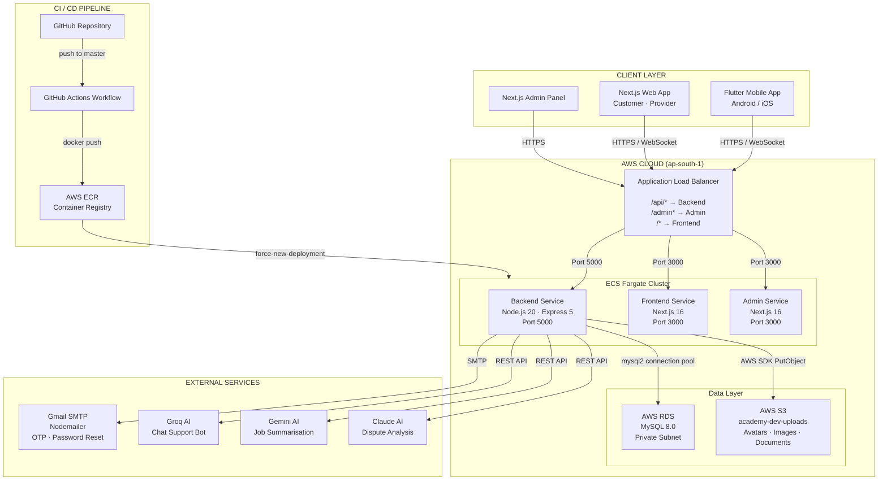

# Kaarkun — System Architecture Diagram

## Component Descriptions

| Component | Technology | Purpose |
|---|---|---|
| Flutter Mobile App | Dart · Flutter 3 | Native Android/iOS app for Customers and Providers |
| Next.js Web App | Next.js 16 · TypeScript | Browser-based interface for Customers and Providers |
| Next.js Admin Panel | Next.js 16 · TypeScript | Internal dashboard for platform administrators |
| Application Load Balancer | AWS ALB | Single entry point; routes traffic by URL path |
| Backend Service | Node.js 20 · Express 5 | REST API + Socket.io WebSocket server |
| Frontend Service | Next.js 16 (SSR) | Serves web app pages |
| Admin Service | Next.js 16 (SSR) | Serves admin panel pages |
| AWS RDS MySQL 8.0 | Amazon RDS | Relational database — users, jobs, bids, bookings |
| AWS S3 | Amazon S3 | Persistent object storage for uploaded files |
| Gmail SMTP | Nodemailer | Sends OTP verification and password-reset emails |
| Groq / Gemini / Claude | Third-party LLM APIs | AI-powered chatbot, job summaries, dispute analysis |
| GitHub Actions | CI/CD Workflow | Builds Docker images, pushes to ECR, redeploys ECS |
