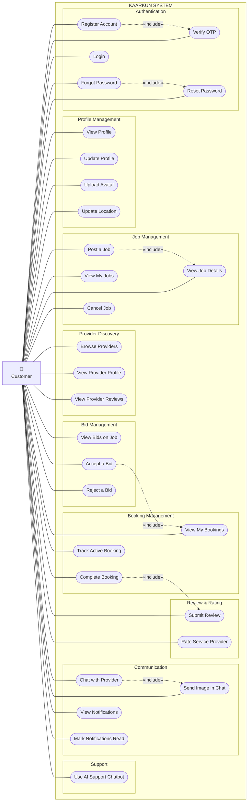

# Use Case Diagram — Customer Actor

## Customer Use Cases Summary

| # | Use Case | Description |
|---|---|---|
| 1 | Register Account | Sign up with name, email, phone, password and optional profile photo |
| 2 | Verify OTP | Confirm email address via 6-digit one-time password |
| 3 | Login | Authenticate with email and password |
| 4 | Forgot Password | Request OTP to reset a forgotten password |
| 5 | Reset Password | Set a new password using the verified OTP |
| 6 | View Profile | View personal account information |
| 7 | Update Profile | Edit name, phone number and location |
| 8 | Upload Avatar | Change profile photo |
| 9 | Update Location | Set or update geographical location |
| 10 | Post a Job | Create a new service request with title, description, category, budget and location |
| 11 | View My Jobs | List all posted jobs with their statuses |
| 12 | View Job Details | Inspect a single job and its associated bids |
| 13 | Cancel Job | Remove an open job posting |
| 14 | Browse Providers | Discover service providers in the system |
| 15 | View Provider Profile | Inspect a provider's experience, skills and rating |
| 16 | View Provider Reviews | Read reviews left by other customers |
| 17 | View Bids on Job | See all bids submitted by providers for a job |
| 18 | Accept a Bid | Select a provider's bid to create a booking |
| 19 | Reject a Bid | Decline a provider's proposal |
| 20 | View My Bookings | List all active and past bookings |
| 21 | Track Active Booking | Monitor the status of an ongoing service |
| 22 | Complete Booking | Mark a service as completed |
| 23 | Submit Review | Write a review for the service received |
| 24 | Rate Service Provider | Give a star rating to a provider |
| 25 | Chat with Provider | Send and receive real-time messages |
| 26 | Send Image in Chat | Attach and share image files in conversation |
| 27 | View Notifications | Read system and activity notifications |
| 28 | Mark Notifications Read | Dismiss individual or all notifications |
| 29 | Use AI Support Chatbot | Ask the AI assistant for platform help |
