# Use Case Diagram — Service Provider Actor

```mermaid
graph LR
    ACTOR["👤\nService Provider"]

    subgraph SYSTEM["KAARKUN SYSTEM"]

        subgraph AUTH["Authentication"]
            UC1(["Register Account"])
            UC2(["Upload CNIC"])
            UC3(["Upload Certificates"])
            UC4(["Verify OTP"])
            UC5(["Login"])
            UC6(["Forgot Password"])
            UC7(["Reset Password"])
        end

        subgraph PROFILE["Profile Management"]
            UC8(["View Profile"])
            UC9(["Update Profile"])
            UC10(["Upload Avatar"])
            UC11(["Update Bio & Skills"])
            UC12(["Set Availability"])
            UC13(["Update Location"])
        end

        subgraph DASHBOARD["Dashboard"]
            UC14(["View Dashboard"])
            UC15(["View Earnings Summary"])
            UC16(["View Performance Stats"])
        end

        subgraph JOBS["Job Discovery"]
            UC17(["Browse Available Jobs"])
            UC18(["Filter Jobs by Category"])
            UC19(["View Job Details"])
            UC20(["View Job Location on Map"])
        end

        subgraph BIDS["Bid Management"]
            UC21(["Place a Bid"])
            UC22(["View My Bids"])
            UC23(["View Bid Status"])
        end

        subgraph BOOKINGS["Booking Management"]
            UC24(["View My Bookings"])
            UC25(["Accept Booking"])
            UC26(["Start Service"])
            UC27(["Complete Service"])
        end

        subgraph REVIEWS["Reviews & Ratings"]
            UC28(["View My Reviews"])
            UC29(["View My Average Rating"])
        end

        subgraph COMMUNICATION["Communication"]
            UC30(["Chat with Customer"])
            UC31(["Send Image in Chat"])
            UC32(["View Notifications"])
            UC33(["Mark Notifications Read"])
        end

        subgraph SUPPORT["Support"]
            UC34(["Use AI Support Chatbot"])
        end

    end

    %% Authentication
    ACTOR --- UC1
    ACTOR --- UC2
    ACTOR --- UC3
    ACTOR --- UC4
    ACTOR --- UC5
    ACTOR --- UC6
    ACTOR --- UC7

    %% Profile
    ACTOR --- UC8
    ACTOR --- UC9
    ACTOR --- UC10
    ACTOR --- UC11
    ACTOR --- UC12
    ACTOR --- UC13

    %% Dashboard
    ACTOR --- UC14
    ACTOR --- UC15
    ACTOR --- UC16

    %% Jobs
    ACTOR --- UC17
    ACTOR --- UC18
    ACTOR --- UC19
    ACTOR --- UC20

    %% Bids
    ACTOR --- UC21
    ACTOR --- UC22
    ACTOR --- UC23

    %% Bookings
    ACTOR --- UC24
    ACTOR --- UC25
    ACTOR --- UC26
    ACTOR --- UC27

    %% Reviews
    ACTOR --- UC28
    ACTOR --- UC29

    %% Communication
    ACTOR --- UC30
    ACTOR --- UC31
    ACTOR --- UC32
    ACTOR --- UC33

    %% Support
    ACTOR --- UC34

    %% Include relationships
    UC1 -. "«include»" .-> UC2
    UC1 -. "«include»" .-> UC3
    UC1 -. "«include»" .-> UC4
    UC6 -. "«include»" .-> UC7
    UC17 -. "«include»" .-> UC18
    UC19 -. "«include»" .-> UC21
    UC25 -. "«include»" .-> UC24
    UC27 -. "«include»" .-> UC28
    UC30 -. "«include»" .-> UC31
```

## Service Provider Use Cases Summary

| # | Use Case | Description |
|---|---|---|
| 1 | Register Account | Sign up with name, email, phone, password, experience years and service category |
| 2 | Upload CNIC | Submit national identity document for verification |
| 3 | Upload Certificates | Submit professional qualification documents |
| 4 | Verify OTP | Confirm email address via 6-digit one-time password |
| 5 | Login | Authenticate with email and password |
| 6 | Forgot Password | Request OTP to reset a forgotten password |
| 7 | Reset Password | Set a new password using the verified OTP |
| 8 | View Profile | View personal and professional account information |
| 9 | Update Profile | Edit name, phone number and location |
| 10 | Upload Avatar | Change profile photo |
| 11 | Update Bio & Skills | Edit professional biography and skill tags |
| 12 | Set Availability | Toggle availability status for new jobs |
| 13 | Update Location | Set or update geographical location |
| 14 | View Dashboard | Access the provider performance overview screen |
| 15 | View Earnings Summary | See total and recent earnings from completed bookings |
| 16 | View Performance Stats | View total bids, bookings and acceptance rate |
| 17 | Browse Available Jobs | Discover open job postings on the platform |
| 18 | Filter Jobs by Category | Narrow job listings by service category |
| 19 | View Job Details | Inspect job description, budget, location and requirements |
| 20 | View Job Location on Map | See the job's geographical location on a map |
| 21 | Place a Bid | Submit a price proposal and message for a job |
| 22 | View My Bids | List all submitted bids and their current statuses |
| 23 | View Bid Status | Check whether a bid is pending, accepted or rejected |
| 24 | View My Bookings | List all active and completed service bookings |
| 25 | Accept Booking | Confirm a booking created after a bid is accepted |
| 26 | Start Service | Mark a booking as in-progress when arriving on site |
| 27 | Complete Service | Mark a booking as finished upon job completion |
| 28 | View My Reviews | Read feedback written by customers |
| 29 | View My Average Rating | See the aggregated star rating across all reviews |
| 30 | Chat with Customer | Send and receive real-time messages |
| 31 | Send Image in Chat | Attach and share image files in conversation |
| 32 | View Notifications | Read system and activity notifications |
| 33 | Mark Notifications Read | Dismiss individual or all notifications |
| 34 | Use AI Support Chatbot | Ask the AI assistant for platform help |
